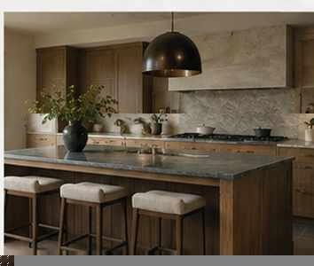

# Kitchen visual references

**Status:** visual shorthand for the September 19, 2026 design-language discussion  
**Use:** interpretive references, not renderings to copy and not build drawings

These images were generated during design exploration. Each is included because Jon reacted to a specific aspect of it. The captions below are controlling; do not silently promote incidental details in the image into decisions.

## 1. Cabinet profile: yes; beige palette: no

**Carry forward:** simple, substantial inset / beaded wood cabinetry; calm grain; clean proportions; real handles.

**Do not carry forward:** the cream-on-cream / beige-on-beige palette. Jon's reaction was essentially: the cabinets are simple and right, but the room has given up too much personality.

This image helped clarify that the target is not minimalism. It is architectural restraint.

## 2. Richer / more contrast: current visual winner

Jon's explicit reaction: **"A bit richer and more contrast for the win."**

**Carry forward:** deeper/richer wood tone, a dark anchoring surface, quiet surrounding stone, strong but limited contrast, restrained overall composition.

**Do not carry forward literally:** gas range, exact hood, pendants, layout, stool design or material assignments. The important information is tonal hierarchy and depth.

This is the best current shorthand for how to avoid an all-beige "luxury neutral" kitchen without introducing visual clutter.

## 3. Guest perch: furniture, not Island #2

**Carry forward:** a freestanding 72 × 42-ish object that reads as furniture through its base, proportions and detailing; clearly distinct from the chef island; no waterfall treatment.

**Do not carry forward literally:** the dark top. The current material hypothesis in [MATERIALS.md](MATERIALS.md) is a furniture-grade wood top, while dark soapstone is a strong candidate for the chef island. This image is about **form and identity**, not a material specification.

## Combined reading

Taken together, the three references point toward:

**quiet inset cabinetry + calm straight grain + richer wood / stronger tonal depth + background stone + restrained functional hardware + a visually quiet cooking wall + a genuinely furniture-like guest perch.**

The kitchen should feel designed, not decorated; functional, not performative; and reserved without becoming beige.
